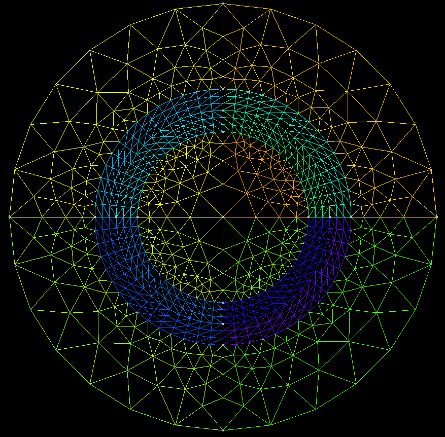

###  `README.md`

# T-Conf: Symmetric Transfinite Mesh Generator

[](https://github.com/YOUR_USERNAME/T-Conforming-Balls/actions/workflows/python-ci.yml)
[](https://doi.org/10.5281/zenodo.XXXXXXXX)

**T-Conf** is a Python library for constructing symmetric, transfinite-conforming meshes using [Gmsh](https://gmsh.info/) for geometries involving concentric **disks** (2D) and **spheres** (3D).

This project was developed for use in FEM methods, where symmetry and structured layering near interfaces are critical for capturing resonance behavior in sign-changin problems.

---

## Installation

Clone the repository and install locally in editable mode:

```bash
git clone https://github.com/YOUR_USERNAME/T-Conforming-Balls.git
cd T-Conforming-Balls
pip install -e .[dev]
````

Make sure Gmsh and its Python API are available in your environment:

```bash
pip install gmsh
```

---

## Usage

You can use the CLI tool to generate meshes directly:

### Disk Example

```bash
tconf disk --a 0.1 --rInner 0.5 --rOuter 1.0 --out my_disk.msh
```

### Sphere Example

```bash
tconf sphere --a 0.2 --rInner 0.8 --rOuter 1.5 --out my_sphere.msh
```

These will generate `.msh` files you can open in Gmsh or use in downstream solvers.

To preview the mesh visually:

```python
import gmsh
gmsh.open("my_disk.msh")
gmsh.fltk.run()
```

---

## Example Mesh Output

---

##  License

This project is licensed under the MIT License. See the [LICENSE](LICENSE) file for details.

---

##  Citation and DOI

A DOI for this software is available via [Zenodo](https://zenodo.org/). To cite this software:

> Latham, B. (2025). *T-Conf: Symmetric Transfinite Mesh Generator*. Zenodo. [https://doi.org/10.5281/zenodo.XXXXXXXX](https://doi.org/10.5281/zenodo.XXXXXXXX)


---

##  Acknowledgments

* [Gmsh](https://gmsh.info/) for its powerful geometry and meshing engine
* [NGSolve](https://ngsolve.org/) for downstream simulation in DG/FEM pipelines
* Transfinite meshing methods were inspired by theoretical work on sign-changing media for FEM, including:

  > A.-S. Bonnet-Ben Dhia, C. Carvalho, and P. Ciarlet Jr.,  
  > *Mesh Requirements for Finite Element Approximation of Problems with Sign-Changing Coefficients*,  
  > Numerische Mathematik 138, pp. 801–838 (2018).